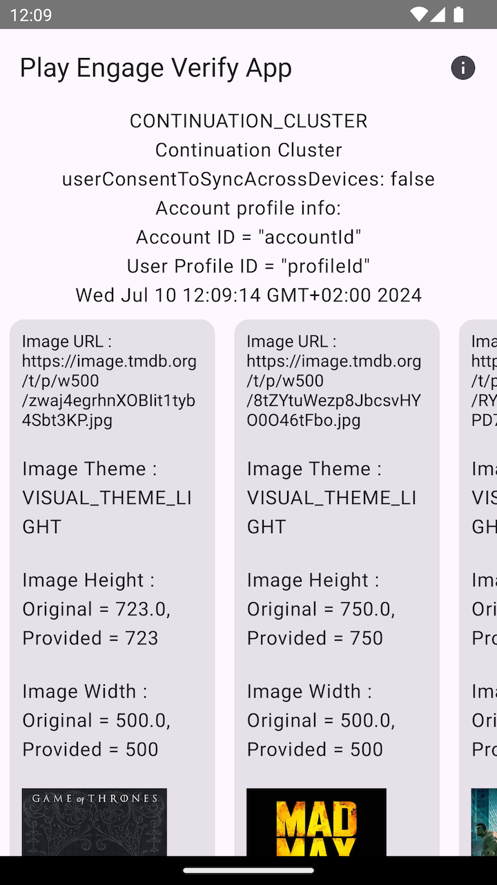
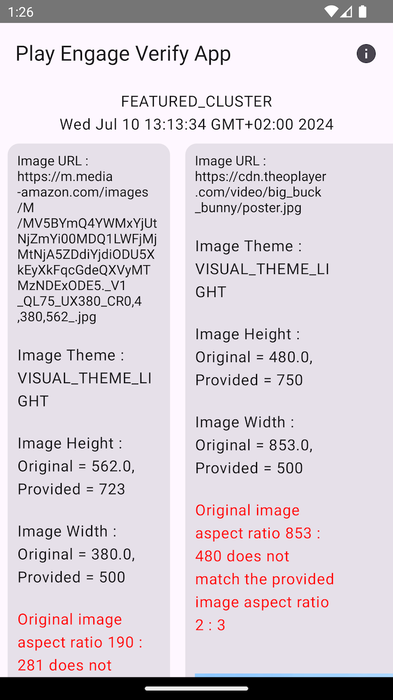

# THEOplayer React-Native Engage Connector

An Engage connector for `@theoplayer/react-native`. Currently only Android platforms are supported.

## Overview

The Engage connector aims to **re-engage users** with your app by offering interesting content, promotions and deals.
Users can be driven directly to a relevant page within your app using **deep links**.

Typical use-cases are
the **"Continue Watching"** feature, which allows users to continue media play-back from where they
left off bookmarks, **(personalized) recommendations** promoting content that might be of interest to the user,
or a **sign-in** option that navigates users to the sign-in page of your app.

Currently, the engage connector only supports the [Android Engage SDK](https://developer.android.com/guide/playcore/engage).

### Terminology

In this document, we will refer to the following concepts:

- **Entity**: A content asset, which can be a "_movie_", "_tvShow_", "_tvSeason_", "_tvEpisode_", "_liveStream_", "_videoClip_", "_signIn_" or "_subscription_".
- **Cluster**: A collection of entities grouped together in single UI view. Available types are:
  - "_Continuation_" or "_Continue Watching_": Contains unfinished videos and relevant newly released episodes.
  - "_Featured_": Showcases a selection of entities.
  - "_Recommendation_": Shows personalized content suggestions.

## Installation

In addition to installing the engage connector module, it is also necessary to add a dependency to
`react-native-mmkv` to allow persistently storing engage data.

```sh
npm install \
  @theoplayer/react-native-engage \
  react-native-mmkv
```

The Engage SDK is set as a peer dependency, so the Android app using it still has to add an explicit dependency in
Gradle, for mobile applications:

```
implementation "com.google.android.engage:engage-core:1.5.4"
```

or, for Android TV:

```
implementation "com.google.android.engage:engage-tv:1.0.0"
```

## Usage

### Creating a connector instance

Create an instance of an Engage client, using either the convenient `useEngage` hook or
by creating a direct instance of the connector:

```tsx
const engageConfig = {
  debug: true,
  recommendationTitle: "Because you enjoyed",
};

// Creating a client instance using the connector
const client = await EngageConnector.createClient(engageConfig);

// ... or, alternatively, by using a hook
const engage = useEngage(engageConfig);
```

### Creating clusters

Using the Engage connector API, a _cluster_ can be created, or requested if it already exists on the device.
A cluster is a grouped set of data which can be of type "Continuation" (or "Continue Watching"), "Featured" or "Recommendation".

```tsx
import { ClusterType, ContinuationClusterConfig } from "@theoplayer/react-native-engage";

const continuationConfig: ContinuationClusterConfig = {
  accountProfile: {
    accountId: 'accountId',
    profileId: 'profileId'
  },
  syncAcrossDevices: false
}

// Create or get the "Continuation" cluster.
const continuation = client.getCluster(ClusterType.Continuation, continuationConfig);
```

Alternatively, the `useCluster` hook can be used:

```tsx
const continuation = useCluster(engage, ClusterType.Continuation, continuationConfig);
```

### Updating or "publishing" cluster data

The cluster data can be updated either **manually** by manipulating its entities:

```tsx
// Add or remove continuation entities.
continuation.addEntity({
  id: "id0",
  name: "The Dark Knight",
  posters: [/**/],
  // ...
});
```

or when requested **by the connector**. For example, on Android platforms when a broadcast message is sent to the app,
or when a scheduled update request is set (e.g., each 12 hours).

### Persisting cluster data

The cluster data is persistently stored on the device each time it is changed. When
the app reopens and creates a new Engage client, the stored that will be loaded first.

### Personalized experience

#### SignIn entity

An optional "_signIn_" entity can be displayed on the engage surface, which directs users
to a sign-in page of the app.

```typescript
const signIn: SignIn = {
  type: EntityType.SignIn,
  name: "Sign In Demo",
  subtitle: "Demonstrates usage of sign-in card",
  actionUri: "https://xyz.com/signin",
  actionText: "Sign In",
  posters: [
    {
      uri: "https://xyz.com/signin.png",
      width: 320,
      height: 180,
      theme: ImageTheme.Light
    }
  ]
}

engage?.setSignInEntity(signIn);
```

#### Subscription and entitlement data

In addition, it is possible to share app subscription and entitlement data via the Engage SDK, allowing
users to easily find content they are entitled to and enable Google TV to deliver highly relevant content
recommendations to users, directly within their Google TV experiences on TV, mobile and tablet.

Subscription information can be published whenever the user performs one of the following actions:

- The user logs in to the app;
- The user switches between profiles, if the app supports single account with multiple profiles;
- The user purchases a new subscription;
- The user upgrades an existing subscription;
- An existing user subscription or tiered subscription expires;

```typescript
const accountProfile = {
  accountId: 'testAccountId',
  profileId: 'testProfileId'
}

const subscription: Subscription = {
  type: EntityType.Subscription,
  providerPackageName: 'testProviderPackage',
  subscriptionType: SubscriptionType.Active
}

engage?.setSubscription(accountProfile, subscription);
```

The "_subscription_" entity that contains one or more entitlements.

## Validating the published items

On Android, the [Verification App ](https://developer.android.com/guide/playcore/engage/workflow#shared-files) can
be used to check the state and contents of all published clusters. Warnings are shown in case
the published data does not satisfy the requirements.

|  |           |
|------------------------------------|---------------------------------------------|
| **Published Continuation cluster** | **Published Feature cluster with warnings** |

## Example application

The example app showcases the integration of the Engage connector in a React Native application.

### Manipulating clusters

Tapping items (or entities) will add them to the "Continuation" cluster, while tapping items
in the Continuation cluster will remove them again. On each update the cluster is persistently
stored and published to the platform.

### Unpublished clusters

Tapping the bin icon results in removing and unpublishing (deleting) the cluster from the
platform.

|           |  |
|----------------------------------------|-------------------------------|
| **Continuation and Featured clusters** | **Swimlanes with entities**   |
